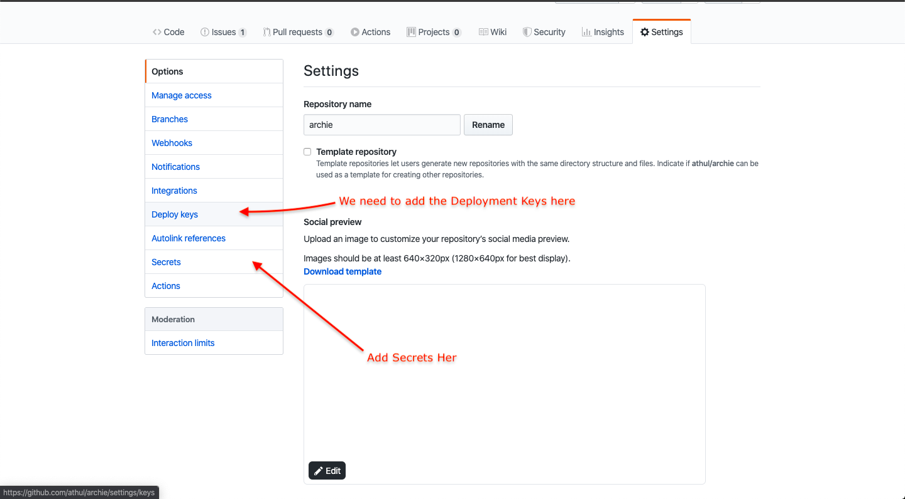

Due to the quarantine I thought of doing something good and useful for others. So I hacked up a theme for Hugo called [Archie](https://athul.github.io/archie). The design was inspired from https://blog.jse.li and was hacked from the ezhil theme for Hugo. The main reason why I built it was due to the Hugo-Ink theme built by [knadh](https://github.com/knadh) since I'm totally a fanboy of him. So deploying Archie to GitHub Pages was quite fun and easily managable. GitHub Actions made it a lot easier since I don't have to rely on any other platforms for deployment.

## Steps to Deploy the Hugo Site
There are a few steps to deploy the Hugo site to GitHub Pages and this is these steps are taken from a [Discussion Thread](https://discourse.gohugo.io/t/deploy-hugo-project-to-github-pages-with-github-actions/20725) in the Hugo Forum   
### Create the SSH Deploy Keys
A question arises here.... Why SSH keys? SSH keys are safe because they are secured with a SHA256 hash. It's also better to use the Deploy key than a GitHub API token as it should be confidential. 

```bash
ssh-keygen -t rsa -b 4096 -C "$(git config user.email)" -f gh-pages -N ""
```
Execute this command and it will generate 2 files:
- `gh-pages.pub` (public key)
- `gh-pages`     (private key)
  
Now we need to add these files to GitHub,for that go to repository setting and click on the Deploy Keys button, add your public key with the Allow write access


Next go to the Secrets button and add the Private key(`gh-pages`) as `ACTION_DEPLOY_KEY.`

To copy the public / private keys just run
```bash
cat gh-pages | pbcopy
``` 
and it will copy the private key to the clipboard

### Defining the Workflow
A workflow is a a file which runs your action on the GitHub Environment, the Workflow is a Yaml file and  it contains specific instructions on what to do and how to do it. 

For our purpose we'll be defining a workflow for deploying to GitHub Pages whenever we get a push to the `master` branch. Paste these in the `.github/workflows/gh-pages.yml` file
```yml
name: Github Pages
on:
  push:
    branches:
      - master
jobs:
  deploy:
    runs-on: ubuntu-18.04
    steps:
      - uses: actions/checkout@v2
        with:
          submodules: true

      - name: Setup Hugo
        uses: peaceiris/actions-hugo@v2
        with:
          hugo-version: '0.67.1'
      - name: Build
        run: hugo --minify
      - name: Deploy
        uses: peaceiris/actions-gh-pages@v3
        with:
          deploy_key: ${{ secrets.ACTIONS_DEPLOY_KEY }}
          publish_dir: ./public
``` 
> Note: Before deploying, just add the url to which you're going to deploy in the baseURL of the `config.toml` file with a trailing `/`

----