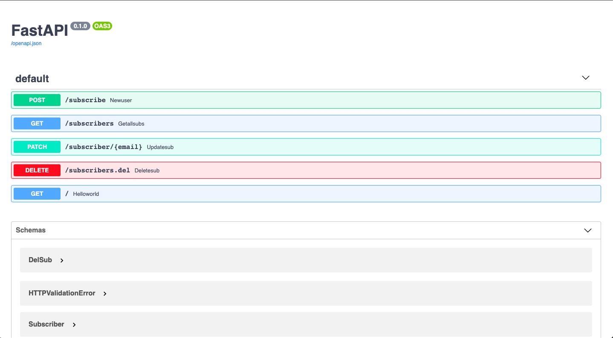

[FastAPI](https://fastapi.tiangolo.com/) is a a Python Framework for building RESTful APIs. It has all the simplicity of Python with a added advantages of Async⚡️, automatic Schema Generation and OpenAPI and Python Types✨(with Pydantic). FastAPI is relatively a new Project and is gaining quite a good traction in the Dev world. It has got nearly [16k stars on GitHub](https://github.com/tiangolo/fastapi) and about 160 contributors. The main plus side of FastAPI is the documentation which is **Top Notch**.

[Deta](https://deta.sh) is a company that is building a cloud platform which is developer friendly and to reduce the hassle from idea to app.

> *"Deta is building a cloud for the developers with less build "bells and whistles", only what's needed to get the job done – a Micro Cloud."*

Personally what attracted me to deta was the ease to implement. I was having a hard time to connect FastAPI with SQLalchemy since I am a noob. Then Deta entered or at least then I came to know about it.

I was skeptical at first, but the simplicity of working with Deta amazed me and their Slack community is ✨. The creators are almost active everytime and they will help you in anyway possible to overcome an issue.

## What we'll build
We're going to build a Personal **Mailing List** API with 

- FastAPI for the API and Logic
- Deta.sh as our DB
- Deploy it on Deta Micros
 
We're only going to build the API, you can use [Mailgun](https://www.mailgun.com/) or [SendGrid](https://sendgrid.com/) to send the emails. Our API will consist of 4 Operations.

- Add a new Person to our List
- Get all the emails from our list
- Update the email of a specific user in our List
- Delete a Subscriber/User from our List

## Setting up FastAPI and Deta

Hope you have Python 3.6+ interpreter on your machine. If you don't make sure to download it and install and verify by running python in your terminal

```bash
$ python3
Python 3.7.6 (default, Dec 30 2019, 19:38:26)
[Clang 11.0.0 (clang-1100.0.33.16)] on darwin
Type "help", "copyright", "credits" or "license" for more information.
>>>
```

The above output is on my machine and it will change from machine to machine.

Next thing is to have a folder and a virtual environment, for that we could use either Pipenv or venv. [Pipenv](https://pipenv-fork.readthedocs.io/en/latest/) is a package for handling and managing Python envs automatically, you can install pipenv with,

```bash
$ pip install --user pipenv
```

Once we installed Pipenv to set up our environment follow the commands to install

- FastAPI
- Uvicorn - The ASGI Server
- Deta - Python Wrapper for the Deta Bases

```bash
$ mkdir mailing-list
$ cd mailing-list
$ pipenv shell #it will make the virtual environment
$ pipenv install fastapi uvicorn deta
```

If we're using venv, then for creating a venv and installing the packages, follow

```bash
$ mkdir mailing-list
$ cd mailing-list
$ python3 -m venv venv
$ source venv/bin/activate
$ pip install fastapi uvicorn deta
```

These are for Unix like systems and on Windows to activate a Virtualenv follow,

```bash
venv\Scripts\activate

```

Once we have set up our Dev Environment. Let's move on to building the Mailing List.

For Deta, create an Account in Deta and create a new Project and get the Project Key. Save the Project key since it will be shown once. You can save it as an environment variable by executing the below code in Unix like(Linux/Mac).

```bash
export DETA_PROJECT_KEY = <project key>
```

and on Windows, use

```text
set DETA_PROJECT_KEY = <project key>
```

We'll also save the key in a `.env` file. This env file s important for the deployment process. For that we need to create a file called `.env` and save the Project Key like

```text
DETA_PROJECT_KEY = <project key>
```

That's it. Lets move on to the code

-----

## The Code

Let's start by making a simple REST API endpoint with FastAPI on a file called `main.py`

```py
# main.py
from fastapi import FastAPI

app = FastAPI()

@app.get("/")
async def helloworld():
    return "Hello World"
```

This is just a hello world app with FastAPI and for running this, we'll need uvicorn. Execute the following in the terminal/cmd,

```bash
$ uvicorn main:app --reload
INFO:     Uvicorn running on http://127.0.0.1:8000 (Press CTRL+C to quit)
INFO:     Started reloader process [13050] using statreload
INFO:     Started server process [13052]
INFO:     Waiting for application startup.
INFO:     Application startup complete.
```

Our API will be actve the port `8000`. FastAPI has inbuilt support for OpenAPI, Swagger and Redoc. To view the docs for our App, just go to [localhost:8000/docs](localhost:8000/docs). To check if our endpoint works, just execute

```bash
$ curl http://127.0.0.1:8000/
"Hello World"
```

So now, let's move on to our main parts

## New Subscriber

We'll be using the [docs](https://docs.deta.sh/docs/base/lib/) by Deta for all references.

We need to create a new endpoint for a someone to subscribe to our Mailing List. So we'll just need the Person's Name and Email to be in our DB. 

> Take care that in some countries its illegal to send emails to people without consent. We'll make a delete endpoint for them to delete themselves from the list

Let's get on to the code for adding a new subscriber to our list. The Python code without the use of a DB or simply the code with FastAPI. 

```py
# main.py

from fastapi import FastAPI
from pydantic import BaseModel, NameEmail

app = FastAPI()

class Subscriber(BaseModel):
    fullName:str
    email:NameEmail

@app.post("/subscribe")
async def newUser(sub:Subscriber):
    data = sub.dict()
    name = data.get("fullName")
    email = data.get("email")
    return {
        "fullName":name,
        "email":email.email
    }
```

We're using Pydantic `BaseModel` class to *inherit* our `Subscriber` class. Then we make the subscriber class a dict to fetch data from the request's body. `NameEmail` will help us get the name part of the email.

> The output is a NameEmail object which has two properties: name and email. For fred.bloggs@example.com, name property would be "fred.bloggs".

<Callout emoji="🛑">
    Since we're using <u><b>NameEmail</b></u> we'll need to install `email-validator` to work with it. Just run `pip install pydantic[email-validator]`
</Callout><br/>

This snippet will return the things that we have provided to it. I have entered the data by going to  [localhost:8000/docs](http://127.0.0.1:8000/docs) if you have your server running. Our Output if we provide `athul` for name and `athul@example.com` for email will be

```json
{
  "name": "athul",
  "email": "athul@example.com",
   "key": "athul",
}
```

Now let's connect it with Deta.sh. We'll be using Python's `os` package to get the Project Key. We have save the project key to the env vars and restart the server for it to work.

```py
# main.py

import os
from fastapi import FastAPI
from pydantic import BaseModel, NameEmail
from deta import Deta

deta = Deta(os.getenv("DETA_PROJECT_KEY"))
db = deta.Base(<db_name>) #this can be anything related to your use case

app = FastAPI()

class Subscriber(BaseModel):
    fullName:str
    email:NameEmail

@app.post("/subscribe")
async def newUser(sub:Subscriber):
    data = sub.dict()
    name = data.get("fullName")
    email = data.get("email")
    subscriber = db.put({
        "fullName":name,
        "email":email.email
    },key=email.name)
    return subscriber
```

Here we have imported the deta library and initialized it with a db name. We're specifying a key for the data. This key will be the name part of the email since most times it will be unique. If we don't specify a key, deta will generate a unique key for the record.

<Callout emoji="🎁">
    You can have multiple DBs with a single project key
</Callout><br/>

We're using Deta's `PUT` method(/function) to insert our data into our DetaBase. The PUT method will generate a **unique key** for our data and will be stored if we don't specify a key. The output if we add ourselves a new subscriber with provide `John Doe` for name and `john@example.com` for email will be,

```json
{
  "email": "john@example.com",
  "key": "john",
  "fullName": "John Doe"
}
```

So we have made an endpoint for people to subscribe to our Mailing List 🎉.  
Next we'll make an endpoint for people to update a theirs info like their Name or Email.

## Update a Subscriber
We'll create a new `UpdateSubscriber` class for updating a Subscriber's Name or Email. We'll use the `get` and `update` methods of deta to fetch and update the data. We'll also raise an error if the record is not found in the base

```py
# main.py

from typing import Optional
from fastapi import NameEmail,HTTPException

class UpdateSub(BaseModel):
    fullName: Optional[str] = None
    email: Optional[NameEmail] = None

@app.patch("/subscriber/{email}")
async def updateSub(subscriber:UpdateSub,email:NameEmail):
    data = subscriber.dict()
    new_name = data.get("fullName")
    new_email = data.get("email")
    sub = db.get(email.name)
    if sub is None:
        raise HTTPException(400,"User Not Subscribed")
    if new_email is None:
        update = {"fullname":new_name}
    if new_name is None:
        update = {"email":new_email.email}
    db.update(updates=update,key=sub['key'])
    return {"msg":"User Updated"}
```

This endpoint will update the email or fullName of a subscriber but the caveat here is that the key cannot be changed even if the email is changed. Let's make a new user with the name John Reese(Person of Interest) with an initial email `reese@gmail.com`. Now let's update his email using this endpoint, for that our request URL will be as follows,

`http://localhost:8080/subscriber/reese%40example.com` You can see that after the `/subscriber` in the url, we are passing the original email and this is called a **Path Parameter**. We use the path paramter and get the name part of it and use it as the Key. For updating the email, we take the new email and update it in our Deta base with the update command. The updates should be in the form of a Python `dict`. If the operation done is correct, then we'll get a `None` type in return

## Get all Subscribers

This endpoint will send a `GET` HTTP method for fetching all the data from our Deta-Base. We'll use the `fetch` function/method of deta to retreive all the data from our base. The `fetch` function will return a [generator](https://www.programiz.com/python-programming/generator) type, so we'll be using the `next()` function to get all the data as a `List`. The endpoint will be like

```py
@app.get("/subscribers")
async def getAllSubs():
    return {"subscribers":next(db.fetch())}
```

The output of the above request will be

```json
{
  "subscribers": [
    {
      "email": "athul@example.com",
      "key": "athul",
      "name": "Athuk"
    },
    {
      "email": "john@example.com",
      "fullName": "John Doe",
      "key": "john"
    },
    {
      "email": "jhreese@gmail.com",
      "fullName": "John Reese",
      "key": "reese"
    }
  ]
}
```

Now we have setup a Create, Update and Read endpoints. Next we'll look into the Delete operation.

## Delete Subscribers

To delete a subscriber, we'll take in the `fullName` as the input to find the subscriber and if we there is more than one record with the same fullName, we'll fetch the data with email. Then we'll use the `delete` method to delete the record by getting the key from our records. 

```py
# main.py

class DelSub(BaseModel):
    email:Optional[NameEmail]
    fullName:str

@app.delete("/subscribers.del")
async def deleteSub(delsub:DelSub):
    data=delsub.dict()
    name = data.get('fullName')
    email = data.get('email')
    sub = next(db.fetch({'fullName':name}))
    if len(sub) > 1 or len(sub) == 0:
        sub = next(db.fetch({'email':email.email}))
        if len(sub)==0:
            raise HTTPException(400,"email not found")
    db.delete(sub[0]['key'])
    return {"msg":"Record Deleted"}
```

The response if a record is deleted will be a Python `None` type so we respond with a message,

```json
{"msg":"Record Deleted"}
```
So we have made a CRUD API for a personal mailing list. Now let's deploy it.

## Deploy our API
For Deploying our API, we'll need Deta Micros.

> Deta Micros(ervers) are a leightweight but scalable cloud runtime tied to an HTTP endpoint. They are meant to get your apps up and running blazingly fast. Focus on writing your code and Deta will take care of everything else.

You need to have Deta Micros' CLI installed in your system. You can install by following the instructions in this [link](https://docs.deta.sh/docs/micros/getting_started). Once you've installed, we need to login to Deta via the CLI, for that execute the following command

```bash
deta login
```

It'll open a new browser window and will authenticate the CLI. Next we need to start a new micro. We'll also need a `requirements.txt` for managing our dependencies, for that either you can copy the response for the command `pip freeze` and paste it in a file called `requirements.txt` or on *\*nix* systems, you can just execute

```bash
pip freeze > requirements.txt
```

This will paste the output of `pip freeze` to `requirements.txt`. Once we have done we need to deploy it to deta using the command. Once we've done this let's create a new micro, for that we can use the `deta new` command

```bash
$ deta new
{
        "name": "mailing-list",
        "runtime": "python3.7",
        "endpoint": "<url>",
        "visor": "enabled",
        "http_auth": "enabled"
}
```

It will automatically detect that we'll need a Python runtime and will give us a unique link for our micro. Next step is to deploy the API, for that we'll use the `deta deploy` command

```bash
$ deta deploy
Deploying...
Successfully deployed changes
.......
```

Yay we have deployed the API, for the details of the micro, just execute the following for details of the micro.

```bash
$ deta details
{
        "name": "mailing-list",
        "runtime": "python3.7",
        "endpoint": "<url>",
        "visor": "enabled",
        "http_auth": "enabled"
}
```

We need to update the environment variable to set our project_key, execute the `deta update` command like this

```bash
$ deta update -e .env
Updating environment variables...
Successfully updated micro's environment variables

```

You can disable authentication for the API to be publically available, just execute `deta auth disable`.

```bash
$ deta auth disable
Successfully disabled http auth
```

If we go to our Micro's url we'll see a `Hello World` response which we wrote as the `/` endpoint. We can see the OpenAPI spec and the Swagger Documentation, if we go to the `/docs` url, we'll see a page like this



------

Yay we have created an API with FastAPI and Deta and Deployed it to the Web.


That leads to the end of this post, here is the whole source code

```py
import os
from typing import Optional
from fastapi import FastAPI, HTTPException
from pydantic import BaseModel, NameEmail
from deta import Deta

deta = Deta(os.getenv("DETA_PROJECT_KEY"))
db = deta.Base('mailing-list')

app = FastAPI()

class Subscriber(BaseModel):
    fullName:str
    email:NameEmail

@app.post("/subscribe")
async def newUser(sub:Subscriber):
    data = sub.dict()
    name = data.get("fullName")
    email = data.get("email")
    subscriber= db.put({
        "fullName":name,
        "email":email.email
    },key=email.name)
    return subscriber

@app.get("/subscribers")
async def getAllSubs():
    return {"subscribers":next(db.fetch())}

class UpdateSub(BaseModel):
    fullName: Optional[str] = None
    email: Optional[NameEmail] = None

@app.patch("/subscriber/{email}")
async def updateSub(subscriber:UpdateSub,email:NameEmail):
    data = subscriber.dict()
    new_name = data.get("fullName")
    new_email = data.get("email")
    sub = db.get(email.name)
    if sub is None:
        raise HTTPException(400,"User Not Subscribed")
    if new_email is None:
        update = {"fullname":new_name}
    if new_name is None:
        update = {"email":new_email.email}
    db.update(updates=update,key=sub['key'])
    return {"msg":"User Updated"}
class DelSub(BaseModel):
    email:Optional[NameEmail]
    fullName:str

@app.delete("/subscribers.del")
async def deleteSub(delsub:DelSub):
    data=delsub.dict()
    name = data.get('fullName')
    email = data.get('email')
    sub = next(db.fetch({'fullName':name}))
    if len(sub) > 1 or len(sub) == 0:
        sub = next(db.fetch({'email':email.email}))
        if len(sub)==0:
            raise HTTPException(400,"email not found")
    db.delete(sub[0]['key'])
    return {"msg":"Record Deleted"} 

@app.get("/")
async def helloworld():
    return "Hello World"
```

## Conclusion

This is just a demo for getting started with FastAPI with Deta.sh. You can change the key for your preference or use the key generated automatically by Deta. You can also use the email address as your key but you may need to switch the `@` character with something else like a `-` or `_` for its place. If you have any queries or doubts or feedback, you can use the comments section for the same and do let me if this has helped you. Go forth and build awesome stuff ⚡️. Thank You ❤️
