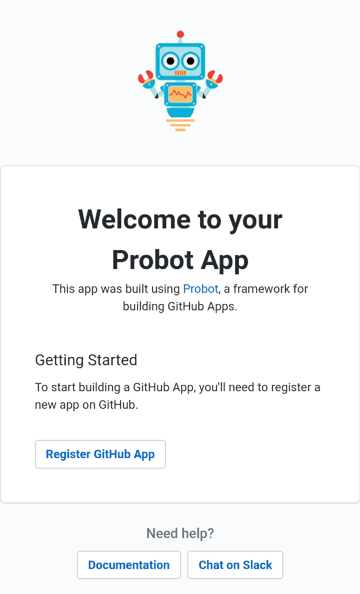

### GitHub Apps with Probot
Ever see in any issues or Pull Request in GitHub where a bot comments on the PR/Issue or adds labels to the PR/Issue? If you have, they are generally termed as GitHub apps and can be made relatively easily.  
Most of these apps are written in JavaScript (Node.js) using **Probot**, a framework for building apps for GitHub. Probot is written in Typescript, a superset of JavaScript. You can find more about on their [website](https://probot.github.io). 

 ---------

 Here we'll make a **Simple Issue and Pull Request commenter** bot which is made and deployed on Glitch.

 ###### Prerequisites
- GitHub account
- An account on Glitch using GitHub
- Basic JavaScript knowledge like variables and strings and functions
#### Making our App on Glitch
Glitch is a free online code-editing platform. It sets up our environment with all the necessary packages and stuff. All you need to do is click this button👇 and you'll get a full working environment for your "Remixing".
<!-- Remix Button -->
<a href="https://glitch.com/edit/#!/remix/twilight-marquis">
  
</a>

What Probot does is that it abstracts the authentication system that all GitHub Apps have to follow - letting you focus on writing API requests without worrying about API tokens or permissions.      
Probot ships with an example of setting up an issue commentor bot in `index.js`.
We'll edit the `index.js` to the following 

 ```js 
//index.js
 module.exports = app => {
  // Your code here
  app.log('Yay, the app was loaded!')
  app.on('issues.opened', async context =>({
    const issue=context.payload.issue //getting issue details
    const user=issue.login.user //Getting the username
    const message=`Thanks @${user} for opening this issue!:tada:
    You are awesome..`
    const params = context.issue({ message })
    return context.github.issues.createComment(params)
)
  })
}
```
The above code is for a bot which comments on new issues. It mentions the user too. The *"Robotic"* characteristics start from the 4th line starting with `app.on` function the first argument passed is the action which the bot listens to. These are **webhook** events of GitHub - you can learn more about them from the [Webhook Documentation](https://developer.github.com/webhooks/).    
Probot uses Node's `async/await` API for returning the data. We used the *`* character to enclose the string/comment body because we won't need to use escape characters and we can also interpolate [Template Literals](https://flaviocopes.com/javascript-template-literals/).         

Now we need to check if our app is working or not, we can do this **clicking** on a "sunglasses" button on Glitch which should look like this <br>    

Then You'll see a Page like this 
 Click the **Register GitHub App** button and provide a name and install it in a repository.
 > Tip: Create a new private repository because we'll be making a lot of noise for the testing   
 
 Now, if you check the `.env`  file you'll see the variable values auto-filled with the necessary data. Glitch automatically deploys our app and our app will be listening to the webhooks to be received.
 
 > Test the app by making a new issue in a test repo on GitHub.   
 
 It works right?  
Congratulations 🎉🎉 You just made yourself a GitHub App👌👌 
##### Redelivering Webhook⤴️
We can view all the webhooks of any event triggered by the Repository and we can redeliver them by going to **Settings->Developer Settings->GitHub Apps->"Your app name"->Advanced Tab** in your profile.
 #### Commenting on PRs
We need to add an extra permission for our App to comment on PRs, we can provide that by going to `Settings->Develope Settings-><Your_app_name> -> Permissions and Events -> Pull Requests` Provide the read and Write Access.  
Now we need to edit the `index.js` to add Support for Pull Request before the last `}`
```js 
//index.js
app.on('pull_request.opened', async context =>{
    const pr = context.payload.pull_request
    const user = pr.user.login //Collecting Details of the person who created the PR
     const msg=context.issue({body:`Hey @${user} :wave: Thanks for the PR !!! You are Awesome.`})
     return context.github.issues.createComment(msg)
  })
```
 Here we add a new _"robotic"_ characteristic by passing a webhook action called *pull_request.opened*. Now our app listens for PR webhook and once received it emits the `context.issue({body})` to GitHub. You can see that we are still passing the body to the *createComment* function. This is because PRs are considered as another type of Issues in GitHub. 
For testing if this works, make a new PR and check if the bot comments on that yes.

-------
Congratulations on making a GitHub app. Since it is on Glitch we can install this in any repository and it will work any time too. 
> You can customise the comments with Images and Gifs but keep in mind that the comments render markdown.
> You can always import these files to a GitHub repository through Glitch.  
 Now go forth, explore and make some exciting GitHub apps,❤️❤️
 ##### Thanks to
- [Jason Etcovich](https://github.com/JasonEtco), for Proofreading this ❤️
- [Musthaq Ahamad](https://github.com/haxzie), for teaching me how to make GitHub Apps
